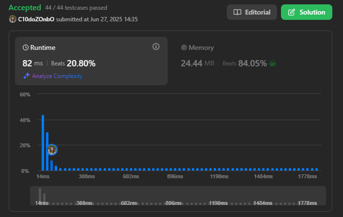
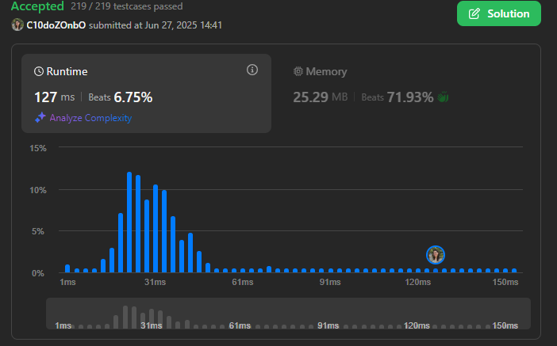
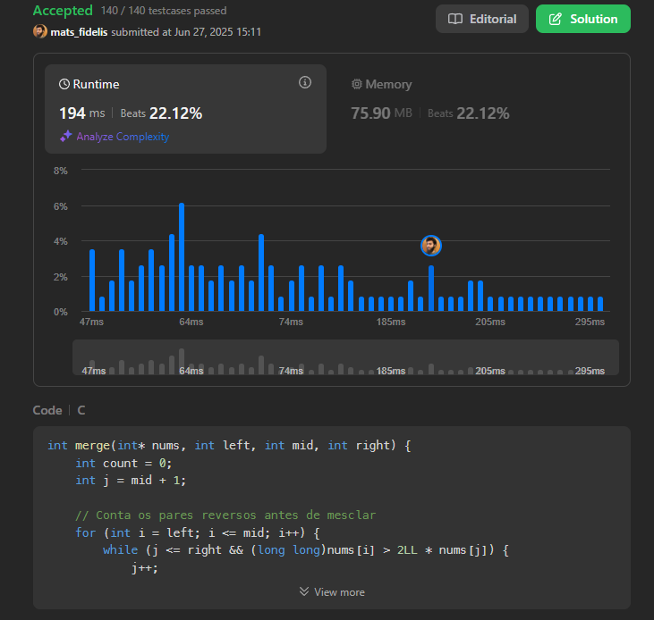
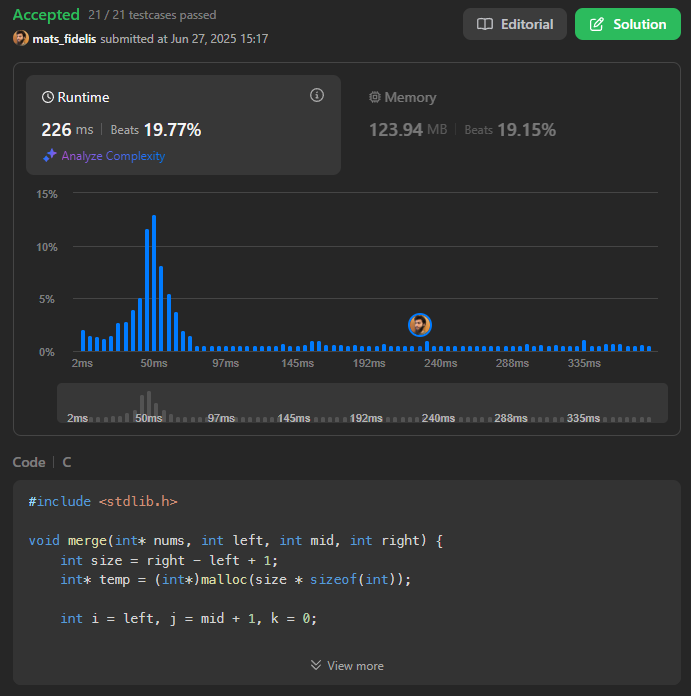

# Lista de Exercícios de um Juiz Online Sobre Dividir e Conquistar

**Número da Lista**: 4<br>
**Conteúdo da Disciplina**: Dividir e Conquistar<br>

## Alunos
|Matrícula | Aluno |
| -- | -- |
| 21/1031584  |  Ana Letícia Melo Pereira |
| 20/0073184 |  Mateus Fidelis Marinho Maia |

## Sobre 
Para desenvolver o conteúdo abordado no tópico de Dividir e Conquistar, a dupla selecionou alguns exercícios em um juiz online - o LeetCode -, sendo eles, de nível médio ou difícil. Para obter mais informações sobre os enunciados propostos, basta clicar no link que aparece no título de cada um.

### 🔗 [218: The Skyline Problem](https://leetcode.com/problems/the-skyline-problem/description/)
 Resumo: Dado uma lista de prédios (com início, fim e altura), determinar os pontos-chave do contorno do skyline (horizonte da cidade) visto de longe, removendo sobreposições e mantendo apenas os pontos onde a altura muda.

- Nível de dificuldade: Difícil

### 🧠 Algoritmo utilizado: Adaptação do par de pontos mais próximos. 

Divide os prédios ao meio recursivamente e faz merge de dois skylines mantendo a maior altura em cada x, evitando pontos redundantes.

---

### 🔗 [1985: Find the Kth Largest Integer in the Array](https://leetcode.com/problems/find-the-kth-largest-integer-in-the-array/)
 Resumo:Dado um array de strings representando inteiros grandes, encontrar o k-ésimo maior inteiro sem utilizar sort completo, considerando que os inteiros podem ser muito grandes para conversão direta.

- Nível de dificuldade: Médio

### 🧠 Algoritmo utilizado: Mediana das medianas.

Usa o algoritmo de seleção determinística linear para encontrar o k-ésimo maior elemento sem ordenar todo o array, garantindo O(n) no pior caso, usando comparação baseada em tamanho e ordem lexicográfica das strings.

---

### 🔗 [493: Reverse Pairs](https://leetcode.com/problems/reverse-pairs/)
Resumo: Dado um array de inteiros, contar o número de pares (i, j) onde i < j e nums[i] > 2 * nums[j].

- Nível de dificuldade: Difícil

### 🧠 Algoritmo utilizado: Merge Sort com contagem de pares especiais (variação da contagem de inversões).

Usa a técnica de dividir e conquistar para ordenar o array enquanto conta os pares que satisfazem a condição nums[i] > 2 * nums[j]. O algoritmo funciona em O(n log n), realizando a contagem antes da mesclagem das metades ordenadas.

---

### 🔗 [912: Sort an Array](https://leetcode.com/problems/sort-an-array/)
Resumo: Dado um array de inteiros, ordenar o array em ordem crescente utilizando uma abordagem eficiente de ordenação.

- Nível de dificuldade: Médio

### 🧠 Algoritmo utilizado: Merge Sort (Dividir e Conquistar).

O algoritmo divide recursivamente o array ao meio, ordena cada metade e, em seguida, realiza a mesclagem das duas metades ordenadas para formar o array final ordenado. Essa técnica tem complexidade O(n log n) no pior caso, tornando-se eficiente para grandes entradas.

---

## Screenshots
- Problema 218


- Problema 1985


- Problema 493


- Problema 912


## Instalação 

Linguagens: C e Python
Pré-requisitos: Compilador GCC, Python 3.4 

## 1. Clone o repositório 

```bash
git clone https://github.com/projeto-de-algoritmos-2025/Grafos1-OnlineJudge.git
```

### 2. Compile o programa

Em C:
```bash
gcc -o nome_do_arquivo.c nome_do_executável  
./nome_do_executável
```

Em Python:
```bash
python arquivo.py
```

## Uso 
Para aplicar os casos de teste (in e out), basta acessar o link referente ao exercício no LeetCode e inserí-los no prompt de comando, também é possível gerar novos casos de teste, desde que cumpram os requisitos do exercício em questão.

## Outros 
A apresentação da entrega pode ser visualizada [aqui](https://unbbr.sharepoint.com/:v:/s/TrabalhodePA412/ESxq0_MSnMJJiSz2V7opxqUBlcI3yPVdAQjQEz3KJhV6ug?e=MzR2Fx&nav=eyJyZWZlcnJhbEluZm8iOnsicmVmZXJyYWxBcHAiOiJTdHJlYW1XZWJBcHAiLCJyZWZlcnJhbFZpZXciOiJTaGFyZURpYWxvZy1MaW5rIiwicmVmZXJyYWxBcHBQbGF0Zm9ybSI6IldlYiIsInJlZmVycmFsTW9kZSI6InZpZXcifX0%3D).
